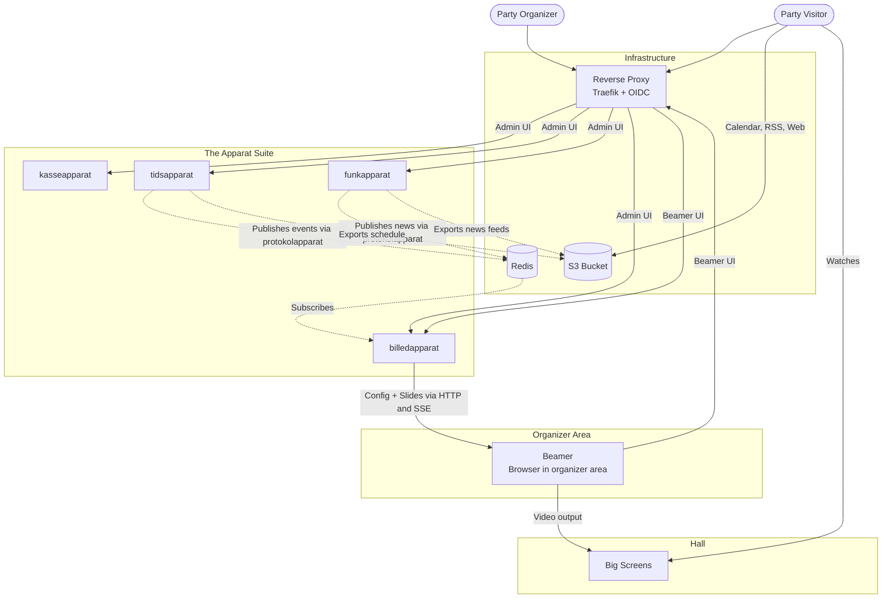

# ⚙️ The Apparat Suite

A set of small, decoupled, single-purpose demoparty management tools. 

Originally built for the [Evoke demoparty](https://www.evoke.eu/) to handle the operational "side quests" that competition-focused systems like [Granola](https://gitlab.com/granola-compo/granola/) intentionally leave out. All tools are open-source, run as Docker containers, and are built with Go and React.

<p align="center">
  <a href="https://github.com/potibm/kasseapparat">
    
  </a>
  &nbsp;&nbsp;&nbsp;&nbsp;
  <a href="https://github.com/potibm/tidsapparat">
    
  </a>
  &nbsp;&nbsp;&nbsp;&nbsp;
  <a href="https://github.com/potibm/funkapparat">
    
  </a>
  &nbsp;&nbsp;&nbsp;&nbsp;
  <a href="https://github.com/potibm/billedapparat">
    
  </a>
</p>

## 📦 The Tools

* **[kasseapparat](https://github.com/potibm/kasseapparat):** Lightweight POS and guestlist manager for the entrance desk.
* **[tidsapparat](https://github.com/potibm/tidsapparat):** Timetable manager to adjust running orders and serve structured schedule data.
* **[funkapparat](https://github.com/potibm/funkapparat):** Minimal news hub for quick text announcements.
* **[billedapparat](https://github.com/potibm/billedapparat):** Big-screen display system for the main hall (rotates slides, pulls live schedules from *tidsapparat* and news from *funkapparat*).
* **[protokolapparat](https://github.com/potibm/protokolapparat):** The shared glue. It defines the protocol and data structures used to exchange news and events between *tidsapparat*, *funkapparat*, and *billedapparat* via Redis.

## 🏗️ Architecture & Interaction

The Apparat suite relies on decoupling. There is no central monolithic database. Instead, the tools communicate asynchronously via Redis. `tidsapparat` and `funkapparat` publish their updates, and `billedapparat` subscribes to them.

For party visitors there are two read paths: `billedapparat` serves a public display UI, where the beamer pulls its playlists and configuration over HTTP and receives live slide updates over an SSE stream, while `tidsapparat` and `funkapparat` can additionally export their data to an S3 bucket. The beamer that drives the hall screens is just a browser on a machine in the organizer area — the big screens only mirror its output. Visitors fetch the exported files directly with a calendar client, an RSS reader or a simple web page — optionally served through a CDN in front of the bucket (e.g. CloudFront, as used at Evoke).

To keep the services lean, there is **no built-in user management**. Authentication and routing should be handled externally via a reverse proxy (like Traefik) and an OIDC provider.



## 🚀 Quickstart (Docker Compose)

The easiest way to run the full suite locally is using `docker compose`. This structural example includes a basic Traefik proxy for routing and a Redis instance for internal communication.

_Note: In a production environment, you should attach an OIDC middleware to Traefik to secure the admin interfaces._

```yaml
# docker-compose.yml
services:
  traefik:
    image: traefik:v3.0
    command:
      - "--api.insecure=true"
      - "--providers.docker=true"
      - "--entrypoints.web.address=:80"
    ports:
      - "80:80"
      - "8080:8080"
    volumes:
      - "/var/run/docker.sock:/var/run/docker.sock:ro"

  redis:
    image: redis:7-alpine
    expose:
      - "6379"

  kasseapparat:
    image: ghcr.io/potibm/kasseapparat:latest
    labels:
      - "traefik.http.routers.kasse.rule=Host(`kasse.apparat.localhost`)"

  tidsapparat:
    image: ghcr.io/potibm/tidsapparat:latest
    environment:
      - REDIS_URL=redis:6379
    labels:
      - "traefik.http.routers.tids.rule=Host(`tids.apparat.localhost`)"

  funkapparat:
    image: ghcr.io/potibm/funkapparat:latest
    environment:
      - REDIS_URL=redis:6379
    labels:
      - "traefik.http.routers.funk.rule=Host(`funk.apparat.localhost`)"

  billedapparat:
    image: ghcr.io/potibm/billedapparat:latest
    environment:
      - REDIS_URL=redis:6379
    labels:
      - "traefik.http.routers.billed.rule=Host(`billed.apparat.localhost`)"
```

Run `docker compose up -d` and access the tools via `http://*.apparat.localhost`.

## ⚙️ Configuration & Data

The `docker-compose.yml` above outlines the general architecture and routing. However, to make the tools fully functional, you need to provide their specific configuration files (e.g., to set the Redis URL, CORS headers, or database paths).

Each tool is configured via its own `config.yaml` or environment variables. Please refer to the documentation in the individual repositories for detailed setup instructions and full configuration examples.